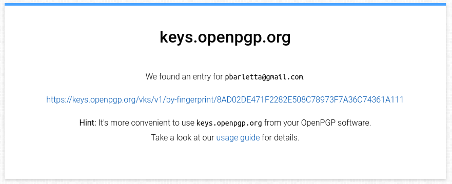

# Migrating to Apptainer

As we said in our last [last singularity post](/blog/singularity_upload),
Singularity is now Apptainer.

We'll now redo our container `locuaz.sif`, but this time using Apptainer.

## Installing Apptainer

First, we get some dependencies that are not usually in a linux desktop. On a 
ubuntu-based system we do:

```
apt install fuse2fs squashfuse fuse-overlayfs
```

Then we download Apptainer from the [repo](https://github.com/apptainer/apptainer/releases), and install it:

```
sudo dpkg -i apptainer_<version>_amd64.deb
```

Notice that for some reason the Singularity and Apptainer packages are incompatible, so you'll have to remove Singularity to install Apptainer.
Yeah, the break-up wasn't amicable.

## The definition file

This is the first piece of good news, the definition file stays the same!

## Building the container

In this case, the `apptainer` command is just a drop-in replacement of `singularity`.
So for **locuaz** we do:

```
sudo apptainer build locuaz.sif locuaz.def 
```

## Signing and verifying your container

In our [previous post](/blog/singularity_upload) we used sylabs endpoint to store
our key so users could verify our signature. This time we'll choose the "open"
way to do it.

The steps to generate your key are the same as before, just replace `singularity` with `apptainer` and follow the steps:

```
apptainer key newpair
```

After finishing the wizard to create your key, you can sign you image.
This is how I signed **locuaz**:

```
apptainer sign locuaz.sif
INFO:    Signature created and applied to image 'locuaz.sif'
```

Now, when you created your key, you got a fingerprint, if you missed it,
just list your keys:

```
apptainer key list
```

Push the fingerprint to [openpgp](https://keys.openpgp.org/):

```
apptainer push <FINGERPRINT>
```

This'll work because `keys.openpgp` will be your default after installing apptainer.
If you're not sure of this, list your remotes:

```
$ apptainer remote list
Cloud Services Endpoints
========================

NAME           URI                  ACTIVE  GLOBAL  EXCLUSIVE  INSECURE
DefaultRemote  cloud.apptainer.org  YES     YES     NO         NO
SylabsCloud    cloud.sylabs.io      NO      YES     NO         NO

Keyservers
==========

URI                       GLOBAL  INSECURE  ORDER
https://keys.openpgp.org  YES     NO        1*

* Active cloud services keyserver

Authenticated Logins
=================================

URI               INSECURE
docker://ghcr.io  NO
```

After pushing a new key you'll get an email to the account you set when you created
the key with `apptainer key newpair`. It'll offer you to publicly link the email with
the fingerprint, so users can look you up with the email instead of using the fingerprint:




They could download the public key from there, but it's much easier to do it
on the command line, supplying the openpgp url. For example, to verify `locuaz.sif`:

```
$ apptainer verify --url https://keys.openpgp.org locuaz.sif 
INFO:    Verifying image with PGP key material
[LOCAL]   Signing entity: Patricio Barletta <pbarletta@gmail.com>
[LOCAL]   Fingerprint: 8AD02DE471F2282E508C78973F7A36C74361A111
Objects verified:
ID  |GROUP   |LINK    |TYPE
------------------------------------------------
1   |1       |NONE    |Def.FILE
2   |1       |NONE    |JSON.Generic
3   |1       |NONE    |JSON.Generic
4   |1       |NONE    |FS
[REMOTE]   Signing entity: Patricio Barletta <pbarletta@gmail.com>
[REMOTE]   Fingerprint: 8AD02DE471F2282E508C78973F7A36C74361A111
Objects verified:
ID  |GROUP   |LINK    |TYPE
------------------------------------------------
1   |1       |NONE    |Def.FILE
2   |1       |NONE    |JSON.Generic
3   |1       |NONE    |JSON.Generic
4   |1       |NONE    |FS
INFO:    Verified signature(s) from image 'locuaz.sif'
```

## Uploading to GitHub packages (ghcr)

Finally, we upload our container to a registry. GitHub Packages are available
for everyone and chances are your code is on GitHub already and having everything
put together in one place is nice.

We first get our Personal Access Token (PAT) from GitHub. 
[GitHub docs](https://docs.github.com/en/packages/working-with-a-github-packages-registry/working-with-the-container-registry)
were written for docker users, so our command lines will be a bit different.
This is how I did it:

```
apptainer remote login --username pgbarletta docker://ghcr.io
```

And then pasted my token. Now you should be good to push your container:

```
apptainer push <APPTAINER-CONTAINER>.sif oras://ghcr.io/<NAMESPACE>/<APPTAINER-CONTAINER>.sif:<VERSION>
```

This is how it looked in my case:

```
apptainer push locuaz.sif oras://ghcr.io/pgbarletta/locuaz.sif:0.5.3
```

As of version `1.2.2` Apptainer shows no progress bar or anything like it,
so if it looks like it hanged, just have faith.

And that's it! You can then go to your packages and link it to its corresponding
repo. I'll post again if I find something better but for now this is my chosen protocol.

## References

1. https://github.com/settings/tokens
2. https://docs.github.com/en/authentication/keeping-your-account-and-data-secure/managing-your-personal-access-tokens
3. https://docs.github.com/en/packages/working-with-a-github-packages-registry/working-with-the-container-registry
4. https://apptainer.org/docs/user/main/docker_and_oci.html#github-container-registry
