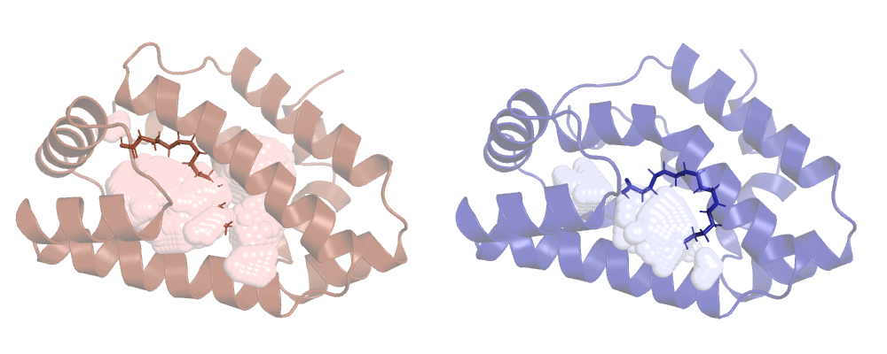
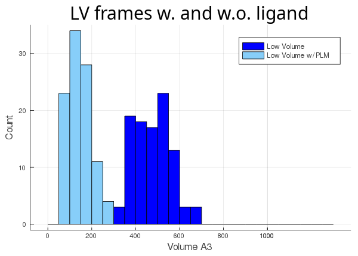
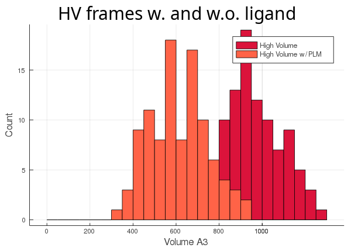

Having learned the basics of ANA Static and ANA Dynamics in the [**quickstart**](/docs/quickstart.html),
we now turn our attention to a few other details and options you might find useful.
As before, you can get all files used in this example [**here**](https://github.com/anadynamics/ANA2/tree/master/aux/dynamics).

## Checking our cavity

We have a Lipid Binding Protein (LBP) from a recent [**paper**](https://pubmed.ncbi.nlm.nih.gov/31365253/)
(PDB ID: **4XCP**) bound to one of its natural ligands, palmitate (PLM). The main cavity of this LBP has
some unusual behaviour, but we'll leave that for the [**Flexibility**](/docs/flexibility.html) tutorial and just
focus on tracking its volume along two 100 frames long trajectories. The two sets of 100 frames were
collected from the same Molecular Dynamics simulation but belonging to two different conformers explored by the protein
trajectory at different times, we'll refer to them as the High Volume (**HV**) and Low Volume (**LV**) trajectories
since they are trajectories of different conformers.

Before tracking the cavities along the trajectories, let's see them on just 1 frame of each conformer. The cavity is
already defined for us in the configuration file **config_1.cfg**, so we'll tell ANA to read from it and to write
the output cavities in files named **lv_cavity_1.pdb** and **hv_cavity_1.pdb** for the **low volume** and **high volume**
conformers:

```
ANA2 4xcp_lv.pdb -c config_1.cfg -f lv_cavity
```
```
[chemfiles] Unknown PDB record: TER
Pocket  481.193
```
```
ANA2 4xcp_hv.pdb -c config_1.cfg -f hv_cavity
```
```
[chemfiles] Unknown PDB record: TER
Pocket  609.672
```

Remember **lv** and **hv** stand for **low volume** and **high volume**, respectively. First, we got a warning
from "chemfiles", that's the library we use to read and write biomolecular files as structures
and trajectories, you can check more about it [**here**](http://chemfiles.org/).

So, as expected, the **lv** reports a smaller cavity than **hv**, let's see them on pymol:


We can clearly see that the cavity overlaps with the ligand, ANA's not taking it into account.
This is ANA's default behaviour, to change it we have to use a new option.

### The `atom_only` option

Before adding this new option, let's check the contents of our original config file, **config_1.cfg**:

```
included_area_atoms = 3 185 260 368 789 1073 1128 1298 1520 1824 1991 2045 
included_area_precision = 1
output_type = grid_pdb 
sphere_count = 5
min_vol_radius = 1.5
```

The first 2 lines should look familiar from the quickstart example. The only difference is that now we're
using atoms to deliniate a cavity instead of residues. This is a bit more cumbersome than picking out residues,
allows for greater detail when defining the cavity.

The next 2 options refer to the output cavity. `grid_pdb` tells ANA to write a PDB with atoms filling out
the tetrahedrons that represent the cavity. `raw_pdb` is the alternative definition of the `output_type` option,
in that case ANA will write a PDB representing the raw empty tetrahedrons. 
If the `output_type` option is set to `grid_pdb`, then the `sphere_count` may be set. It tells ANA how many atoms
to use when filling each tetrahedron. The higher this number, the more dense the resulting tetrahedron will look like.
If this value is too high, it will take ANA longer to draw the output cavity and the resulting PDB will be heavier
and slower to load on a molecule visualizer. So `5` is a good value for this option and is also the default.
None of the ouput types are very pretty, but `grid_pdb` gives a better idea of the cavity.

During volume calculation, ANA removes tetrahedrons with a volume lower than a 1.4A sphere since not all
tetrahedrons represent actual voids. `min_vol_radius` allows you to change this parameter. It's a rarely
used option since its default value (1.4) usually does just fine.

Now we can create a new configuration file (**config_2.cfg**) and add this line:

```
atom_only = false
```

Now ANA won't ignore `HETATM` records and ligands will be included in the calculation. Let's run it
and check the result:

```
> ANA2 4xcp_lv.pdb -c config_2.cfg -f lig_lv_cavity
[chemfiles] Unknown PDB record: TER
Pocket  481.193

> ANA2 4xcp_hv.pdb -c config_2.cfg -f lig_hv_cavity
[chemfiles] Unknown PDB record: TER
Pocket  609.672
```



## Tracking our cavity along a MD run

Now that we have 2 different ways of calculating our cavity and 2 different sets of 100 frames, let's
run all 4 possible combinations and see what we get.

First, we track the cavity discarding the ligand (`atom_only = true`):

```
ANA2 4xcp.pdb -d lv_4xcp.nc -c config_1.cfg -o 1_lv_volume
```
```
[chemfiles] Unknown PDB record: TER
Writing output...
Done
```
```
ANA2 4xcp.pdb -d hv_4xcp.nc -c config_1.cfg -o 1_hv_volume
```
```
[chemfiles] Unknown PDB record: TER
Writing output...
Done
```


Then, we track the cavity taking the ligand into account (`atom_only = false`), and compare the volume differences for each trajectory:

```
ANA2 4xcp.pdb -d lv_4xcp.nc -c config_2.cfg -o 1_lv_volume
```
```
[chemfiles] Unknown PDB record: TER
Writing output...
Done
```
```
ANA2 4xcp.pdb -d hv_4xcp.nc -c config_2.cfg -o 1_hv_volume
```
```
[chemfiles] Unknown PDB record: TER
Writing output...
Done
```






As you can see, the **lv** conformer leaves very little room left for the ligand (light blue histogram),
while the **hv**'s cavity seems oversized for its ligand (orange histogram). The `atom_only` option is set to `true`
by default, since this usually is the desired behaviour. This option was created for the user's
convenience so they wouldn't have to adapt their trajectory, if they didn't want to include all the molecules in the
calculation.

### The `start`, `step` and `stop` options

These are dynamics specific options and were also created to avoid 
trajectory modifications. As their names indicate, they tell ANA which frames to read from an
input trajectory, thus, avoiding unnecessary reading from unimportant frames. Unfortunately, this is only
possible with Amber NetCDF trajectories, since this binary format is the only one that allows the
necessary lazy evaluation. **config_3.cfg** defines these options:

```
start = 5
step = 10
stop = 80
```

These options tell ANA to start tracking the cavity at frame 5, to skip 10 frames at each step and
to stop at frame 80. While ANA is fast, MD trajectories are becoming longer and longer and that's when
these options become useful, especially the `step` option.

You can check the Jupyter notebook **dynamics_tutorial.ipynb** (in the **dynamics** folder linked above)
to see all these results for yourself.

